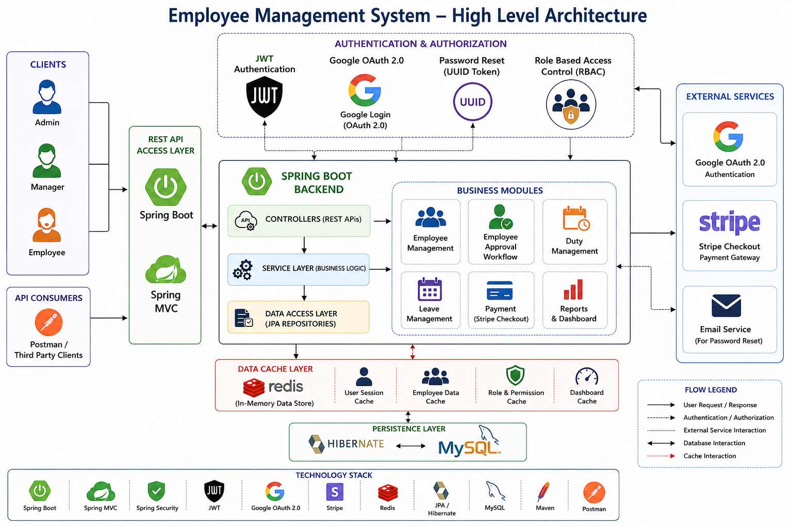

# Employee Management System

A REST API based Employee Management System built using Spring Boot that enables secure employee lifecycle management with JWT Authentication, Google OAuth, Role-Based Access Control, Leave Management, Duty Assignment, Password Reset, and Stripe Payment Integration.

## High Level Architecture Workflow Daigram

---

## Features

### Authentication & Authorization

- JWT Authentication
- Google OAuth 2.0 Login
- Role-Based Access Control (Admin, Manager, Employee)
- Protected REST APIs
- Token Validation
- Secure Login using Username/Email

---

### Admin Module

- Add Manager
- View Managers
- View Employees
- Delete Manager
- Delete Employee
- Assign Duties
- View Assigned Duties
- Approve/Reject Employee Accounts
- View Leave Applications
- Dashboard Statistics

---

### Manager Module

- Employee Management
- Assign Duties
- Approve/Reject Leave Requests
- View Team Members
- Search Employees
- Update Employee Account Status

---

### Employee Module

- View Profile
- Update Profile
- Apply Leave
- View Leave Status
- View Assigned Duties
- Secure Login

---

### Payment Module

- Stripe Checkout Integration
- JWT Secured Payment APIs
- Payment Status Tracking
- Payment History Persistence
- Success & Cancel Handling

---

### Password Management

- Forgot Password
- UUID Based Reset Token
- Reset Password
- Token Expiration Validation

---

## Technology Stack

- Java
- Spring Boot
- Spring MVC
- Spring Security
- Spring Data JPA
- Hibernate
- MySQL
- Redis
- JWT
- Google OAuth 2.0
- Stripe Checkout
- Maven
- REST APIs

---

## Architecture

```
Client (Postman / REST Client)
            │
            ▼
      Spring Boot REST APIs
            │
            ▼
Authentication Layer
├── JWT Authentication
├── Google OAuth
└── RBAC
            │
            ▼
Business Layer
├── Admin Module
├── Manager Module
├── Employee Module
├── Leave Management
├── Duty Management
├── Payment Module
└── Password Reset
            │
            ▼
Spring Data JPA / Hibernate
            │
            ▼
MySQL Database
```

---

## Database Entities

- Admin
- Manager
- Employee
- Duty
- Leave
- Payment
- ResetToken

---

## Authentication Flow

### JWT Login

```
User Login
    │
    ▼
Credential Verification
    │
    ▼
Generate JWT
    │
    ▼
Access Protected APIs
```

### Google OAuth Login

```
Google Login
    │
    ▼
Google Authentication
    │
    ▼
Existing User Verification
    │
    ▼
Generate JWT
    │
    ▼
Access Protected APIs
```

---

## Stripe Payment Flow

```
JWT Authentication
        │
        ▼
Create Checkout Session
        │
        ▼
Stripe Hosted Payment Page
        │
        ▼
Payment Success / Cancel
        │
        ▼
Update Payment Status
        │
        ▼
Store Payment Details
```

---

## REST API Modules

- Authentication APIs
- Admin APIs
- Manager APIs
- Employee APIs
- Duty APIs
- Leave APIs
- Payment APIs
- OAuth APIs
- Password Reset APIs

---

## Security

- JWT Authentication
- Google OAuth 2.0
- Role-Based Authorization
- Password Reset Token Validation
- Protected Endpoints
- Stripe Secure Checkout

---

## Future Enhancements

- Docker Deployment
- CI/CD Pipeline
- Email Notifications
- Payment History Dashboard
- Audit Logging
- Unit & Integration Testing

---

## Author

**Anshu Vairagade**